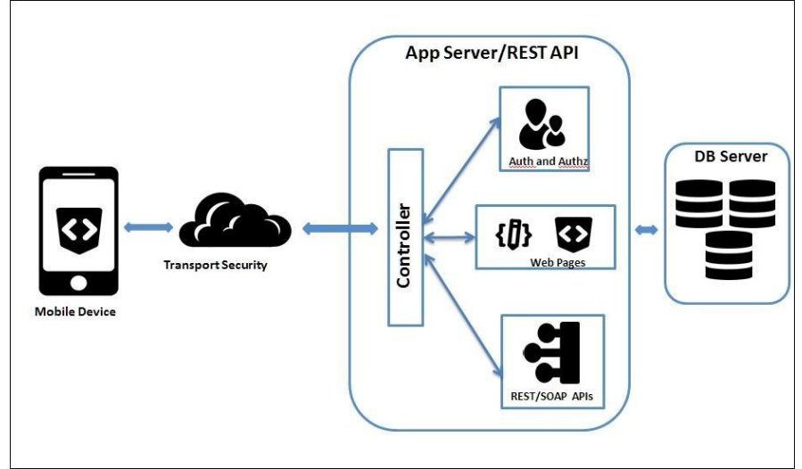
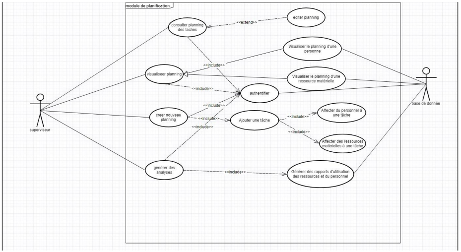
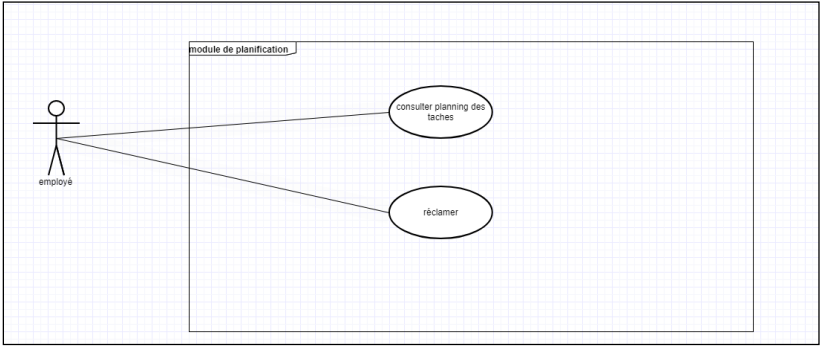
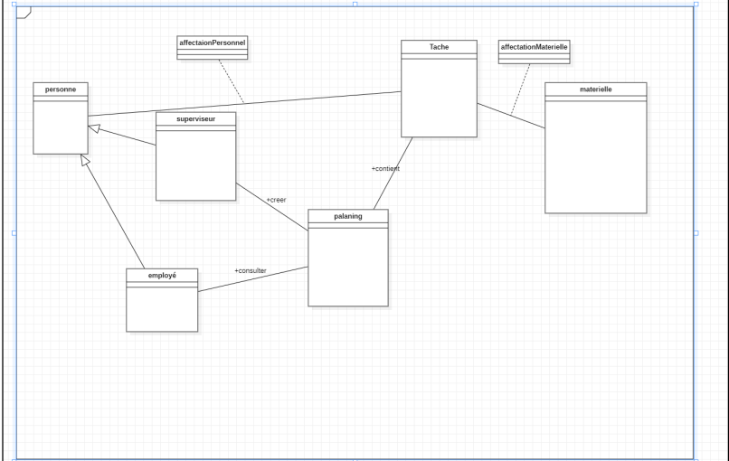
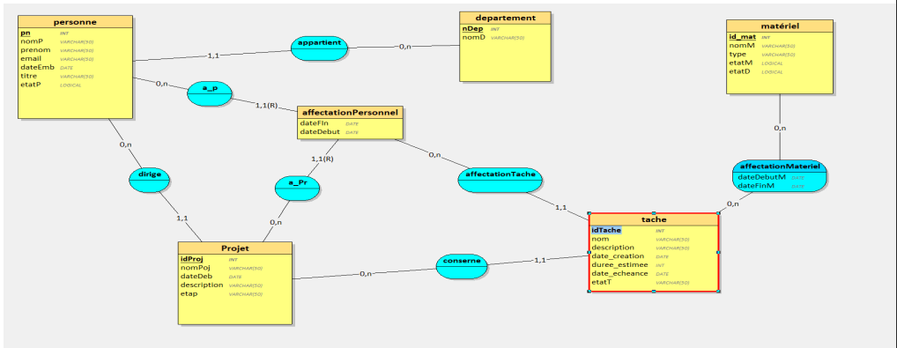

# Material Resources Management

This project aims to implement a solution for managing hardware resources. It aims to provide a portable, simple, shared, and comprehensive platform for the efficient management of hardware resources.

## Main Objectives:

- Propose a simple and shared platform for managing hardware resources.
- Address identified gaps in existing ERP solutions concerning the issue.

## Project Contents:

### Project Architecture:

## General Design:

#### Use Case Diagrams:

#### Class Diagrams:

## Database Schema:

## How to Contribute:

1. **Clone the Project**: `git clone [project link]`
2. **Create a Branch**: `git checkout -b your_branch_name`
3. **Make Your Changes**
4. **Commit Changes**: `git commit -m "Description of changes"`
5. **Push to the Branch**: `git push origin your_branch_name`
6. **Create a Pull Request** explaining the modifications made.

## Project Configuration

Make sure to configure the project correctly by following these steps:

1. **Install Dependencies**:`pip install -r requirements.txt` (depending on your environment).
2. **Configure the Database**: Follow the instructions in the `/database` folder.

## License

This project is under the [insert license type] license - see the [LICENSE.md](LICENSE.md) file for more details.

---

Feel free to customize this template based on the specifics of your project. If you have any questions or suggestions, don't hesitate to share them.
